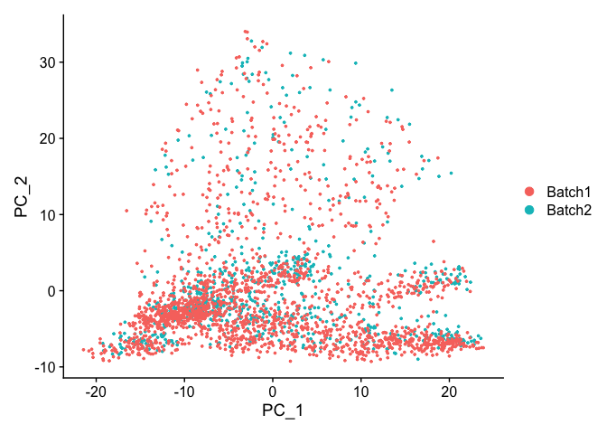
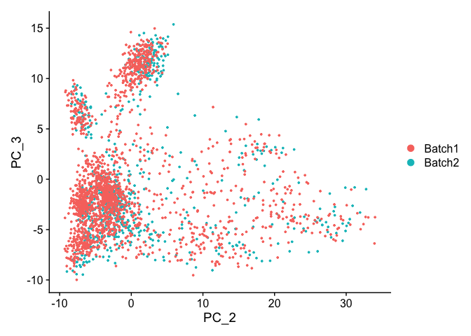
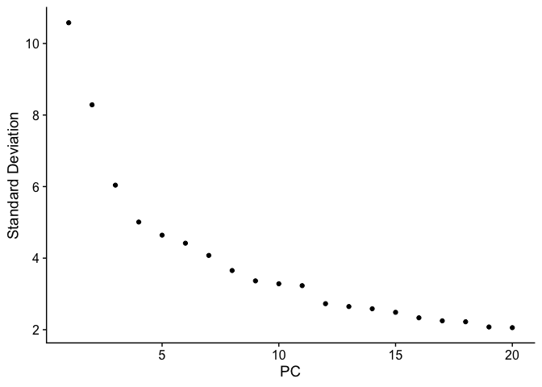
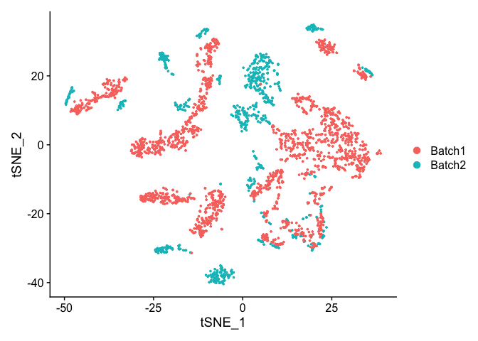
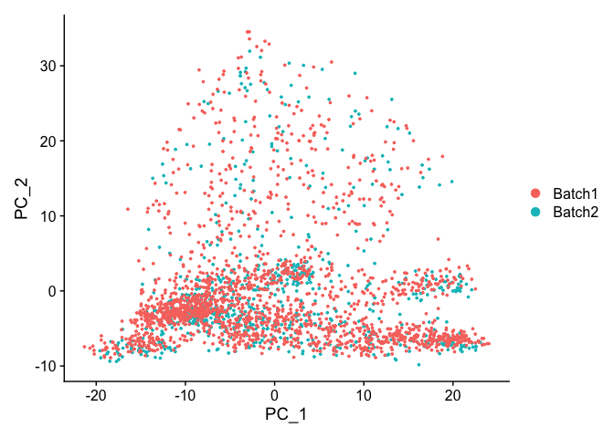
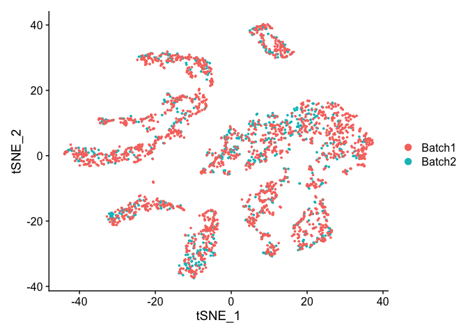

## Load libraries

```r
library(Seurat)
```

## Load the Seurat object

```r
load(file="pre_sample_corrected.RData")
experiment.aggregate
```

<div class='r_output'> An object of class Seurat 
 12811 features across 2681 samples within 1 assay 
 Active assay: RNA (12811 features, 2000 variable features)
</div>
```r
experiment.test <- experiment.aggregate
set.seed(12345)
rand.genes <- sample(1:nrow(experiment.test), 500,replace = F)
mat <- as.matrix(GetAssayData(experiment.test, slot="data"))
mat[rand.genes,experiment.test$batchid=="Batch2"] <- mat[rand.genes,experiment.test$batchid=="Batch2"] + 0.22
experiment.test = SetAssayData(experiment.test, slot="data", new.data= mat )
```

## Exploring Batch effects, none, Seurat [vars.to.regress]

First lets view the data without any corrections

## PCA in prep for tSNE

ScaleData - Scales and centers genes in the dataset. 

```r
?ScaleData
experiment.test.noc <- ScaleData(object = experiment.test)
```

<div class='r_output'> Centering and scaling data matrix
</div>
### Run PCA

```r
experiment.test.noc <- RunPCA(object = experiment.test.noc)
```

<div class='r_output'> PC_ 1 
 Positive:  Txn1, Sncg, Fez1, S100a10, Atp6v0b, Lxn, Dctn3, Tppp3, Sh3bgrl3, Rabac1 
 	   Cisd1, Ppia, Fxyd2, Stmn3, Atp6v1f, Ndufa11, Atp5g1, Bex2, Atpif1, Uchl1 
 	   Ndufa4, Psmb6, Ubb, Hagh, Anxa2, Gabarapl2, Rgs10, Nme1, Prdx2, Psmb3 
 Negative:  Mt1, Malat1, Adcyap1, Ptn, Apoe, Zeb2, Mt2, Timp3, Fabp7, Gpm6b 
 	   Gal, Kit, Qk, Plp1, Atp2b4, Ifitm3, 6330403K07Rik, Sparc, Id3, Gap43 
 	   Selenop, Gpx3, Zfp36l1, Rgcc, Scg2, Cbfb, Zfp36, Igfbp7, Marcksl1, Phlda1 
 PC_ 2 
 Positive:  Nefh, Cntn1, Thy1, S100b, Sv2b, Cplx1, Slc17a7, Vamp1, Nefm, Lynx1 
 	   Endod1, Scn1a, Atp1b1, Vsnl1, Nat8l, Ntrk3, Sh3gl2, Fam19a2, Eno2, Scn1b 
 	   Spock1, Scn8a, Glrb, Syt2, Lrrn1, Scn4b, Lgi3, Snap25, Atp2b2, Cpne6 
 Negative:  Malat1, Cd24a, Tmem233, Cd9, Dusp26, Mal2, Carhsp1, Tmem158, Fxyd2, Ctxn3 
 	   Prkca, Ubb, Crip2, Arpc1b, S100a6, Gna14, Cd44, Tmem45b, Klf5, Tceal9 
 	   Cd82, Hs6st2, Bex3, Emp3, Ift122, Fam89a, Pfn1, Acpp, Dynll1, Smim5 
 PC_ 3 
 Positive:  P2ry1, Fam19a4, Gm7271, Rarres1, Th, Zfp521, Wfdc2, Tox3, Gfra2, D130079A08Rik 
 	   Iqsec2, Pou4f2, Rgs5, Kcnd3, Id4, Rasgrp1, Slc17a8, Casz1, Cdkn1a, Piezo2 
 	   Dpp10, Gm11549, Fxyd6, Spink2, Rgs10, Zfhx3, C1ql4, Cd34, Gabra1, Cckar 
 Negative:  Calca, Basp1, Gap43, Ppp3ca, Map1b, Scg2, Cystm1, Tmem233, Calm1, Ift122 
 	   Map7d2, Tubb3, Ncdn, Resp18, Prkca, Etv1, Nmb, Skp1a, Crip2, Camk2a 
 	   Epb41l3, Tspan8, Ntrk1, Deptor, Gna14, Adk, Jak1, Tmem255a, Etl4, Camk2g 
 PC_ 4 
 Positive:  Id3, Timp3, Selenop, Pvalb, Ifitm3, Sparc, Igfbp7, Adk, Sgk1, Tm4sf1 
 	   Ly6c1, Id1, Etv1, Nsg1, Slc17a7, Mt2, Zfp36l1, Cldn5, Spp1, Ier2 
 	   Aldoc, Shox2, Cxcl12, Ptn, Qk, Itm2a, Stxbp6, Sparcl1, Jak1, Slit2 
 Negative:  Gap43, Calca, Stmn1, Tac1, Ppp3ca, 6330403K07Rik, Arhgdig, Alcam, Adcyap1, Prune2 
 	   Kit, Ngfr, Ywhag, Gal, Fxyd6, Atp1a1, Smpd3, Ntrk1, Tmem100, Cd24a 
 	   Atp2b4, Mt3, Cnih2, Tppp3, Gpx3, S100a11, Scn7a, Snap25, Cbfb, Gnb1 
 PC_ 5 
 Positive:  Cpne3, Klf5, Acpp, Fxyd2, Jak1, Rgs4, Osmr, Nppb, Zfhx3, Nbl1 
 	   Etv1, Htr1f, Gm525, Sst, Adk, Tspan8, Parm1, Tmem233, Cysltr2, Prkca 
 	   Cd24a, Prune2, Npy2r, Nts, Dgkz, Socs2, Gnb1, Phf24, Plxnc1, Il31ra 
 Negative:  Mt1, Ptn, B2m, Prdx1, Dbi, Mt3, Ifitm3, Mt2, Fxyd7, Id3 
 	   Calca, S100a16, Sparc, Pcp4l1, Ifitm2, Selenop, Hspb1, Igfbp7, Rgcc, Selenom 
 	   Abcg2, S100a13, Itm2a, Apoe, Tm4sf1, Timp3, Cebpd, Ubb, Ly6c1, Phlda1
</div>
```r
DimPlot(object = experiment.test.noc, group.by = "batchid", reduction = "pca")
```



```r
DimPlot(object = experiment.test.noc, group.by = "batchid", dims = c(2,3), reduction = "pca")
```



PCA Elbow plot to determine how many principal components to use in downstream analyses.  Components after the "elbow" in the plot generally explain little additional variability in the data.


```r
ElbowPlot(experiment.test.noc)
```

<!-- -->

We use 10 components in downstream analyses. Using more components more closely approximates the full data set but increases run time.

### TSNE Plot

```r
pcs.use <- 10
experiment.test.noc <- RunTSNE(object = experiment.test.noc, dims = 1:pcs.use)
DimPlot(object = experiment.test.noc,  group.by = "batchid")
```



## Correct for sample to sample differences (seurat)

Use vars.to.regress to correct for the sample to sample differences and percent mitochondria

```r
experiment.test.regress <- ScaleData(object = experiment.test, 
                    vars.to.regress = c("batchid"), model.use = "linear")
```

<div class='r_output'> Regressing out batchid
</div>
<div class='r_output'> Centering and scaling data matrix
</div>
```r
experiment.test.regress <- RunPCA(object =experiment.test.regress)
```

<div class='r_output'> PC_ 1 
 Positive:  Txn1, Sncg, Fez1, S100a10, Atp6v0b, Lxn, Dctn3, Tppp3, Sh3bgrl3, Rabac1 
 	   Cisd1, Ppia, Fxyd2, Atp6v1f, Stmn3, Ndufa11, Atp5g1, Bex2, Atpif1, Uchl1 
 	   Ndufa4, Psmb6, Ubb, Hagh, Anxa2, Gabarapl2, Rgs10, Nme1, Prdx2, Psmb3 
 Negative:  Mt1, Malat1, Adcyap1, Ptn, Apoe, Zeb2, Mt2, Timp3, Fabp7, Gpm6b 
 	   Gal, Kit, Qk, Atp2b4, Plp1, Ifitm3, 6330403K07Rik, Sparc, Id3, Gap43 
 	   Gpx3, Selenop, Zfp36l1, Rgcc, Scg2, Cbfb, Zfp36, Igfbp7, Marcksl1, Phlda1 
 PC_ 2 
 Positive:  Nefh, Cntn1, Thy1, S100b, Sv2b, Cplx1, Slc17a7, Vamp1, Nefm, Lynx1 
 	   Endod1, Atp1b1, Scn1a, Nat8l, Vsnl1, Ntrk3, Sh3gl2, Fam19a2, Eno2, Scn1b 
 	   Spock1, Scn8a, Glrb, Syt2, Scn4b, Lrrn1, Atp2b2, Lgi3, Cpne6, Snap25 
 Negative:  Malat1, Cd24a, Tmem233, Cd9, Dusp26, Mal2, Tmem158, Carhsp1, Fxyd2, Ctxn3 
 	   Ubb, Prkca, Arpc1b, Crip2, S100a6, Gna14, Cd44, Tmem45b, Klf5, Tceal9 
 	   Bex3, Hs6st2, Cd82, Emp3, Pfn1, Ift122, Tubb2b, Fam89a, Dynll1, Gadd45g 
 PC_ 3 
 Positive:  P2ry1, Fam19a4, Gm7271, Rarres1, Th, Zfp521, Wfdc2, Tox3, Gfra2, D130079A08Rik 
 	   Iqsec2, Pou4f2, Rgs5, Kcnd3, Id4, Rasgrp1, Slc17a8, Casz1, Cdkn1a, Piezo2 
 	   Dpp10, Gm11549, Fxyd6, Rgs10, Spink2, Zfhx3, C1ql4, Cd34, Gabra1, Cckar 
 Negative:  Calca, Basp1, Gap43, Ppp3ca, Map1b, Scg2, Cystm1, Tmem233, Map7d2, Calm1 
 	   Ift122, Tubb3, Ncdn, Resp18, Prkca, Etv1, Nmb, Skp1a, Crip2, Epb41l3 
 	   Camk2a, Ntrk1, Tspan8, Deptor, Gna14, Adk, Jak1, Tmem255a, Etl4, Camk2g 
 PC_ 4 
 Positive:  Id3, Timp3, Selenop, Pvalb, Ifitm3, Sparc, Igfbp7, Adk, Tm4sf1, Ly6c1 
 	   Sgk1, Id1, Etv1, Nsg1, Mt2, Cldn5, Zfp36l1, Ier2, Itm2a, Spp1 
 	   Slc17a7, Aldoc, Ptn, Cxcl12, Shox2, Qk, Stxbp6, Sparcl1, Slit2, Jak1 
 Negative:  Gap43, Calca, Stmn1, Tac1, Ppp3ca, Arhgdig, 6330403K07Rik, Alcam, Prune2, Adcyap1 
 	   Kit, Ngfr, Ywhag, Atp1a1, Fxyd6, Gal, Smpd3, Ntrk1, Tmem100, Cd24a 
 	   Atp2b4, Mt3, Cnih2, Tppp3, Scn7a, Gpx3, S100a11, Snap25, Gnb1, Cbfb 
 PC_ 5 
 Positive:  Cpne3, Klf5, Jak1, Acpp, Fxyd2, Nppb, Osmr, Gm525, Htr1f, Sst 
 	   Etv1, Nbl1, Rgs4, Zfhx3, Cysltr2, Adk, Tspan8, Npy2r, Nts, Parm1 
 	   Tmem233, Prkca, Cd24a, Socs2, Prune2, Il31ra, Dgkz, Ptafr, Gnb1, Ptprk 
 Negative:  Mt1, Ptn, B2m, Dbi, Prdx1, Mt3, Fxyd7, Ifitm3, S100a16, Calca 
 	   Id3, Mt2, Pcp4l1, Sparc, Selenop, Ifitm2, Rgcc, Igfbp7, Abcg2, Tm4sf1 
 	   Apoe, Selenom, S100a13, Cryab, Hspb1, Timp3, Gap43, Ubb, Ly6c1, Phlda1
</div>
```r
DimPlot(object = experiment.test.regress, group.by = "batchid", reduction = "pca")
```



### Corrected TSNE Plot

```r
experiment.test.regress <- RunTSNE(object = experiment.test.regress, dims.use = 1:pcs.use)
DimPlot(object = experiment.test.regress, group.by = "batchid", reduction = "tsne")
```



#### Question(s)

1. Try a couple of PCA cutoffs (low and high) and compare the TSNE plots from the different methods.  Do they look meaningfully different?

## Get the next Rmd file

```r
download.file("https://raw.githubusercontent.com/ucdavis-bioinformatics-training/2020-Intro_Single_Cell_RNA_Seq/master/data_analysis/scRNA_Workshop-PART4.Rmd", "scRNA_Workshop-PART4.Rmd")
```

## Session Information

```r
sessionInfo()
```

<div class='r_output'> R version 4.0.0 (2020-04-24)
 Platform: x86_64-apple-darwin17.0 (64-bit)
 Running under: macOS Catalina 10.15.4
 
 Matrix products: default
 BLAS:   /Library/Frameworks/R.framework/Versions/4.0/Resources/lib/libRblas.dylib
 LAPACK: /Library/Frameworks/R.framework/Versions/4.0/Resources/lib/libRlapack.dylib
 
 locale:
 [1] en_US.UTF-8/en_US.UTF-8/en_US.UTF-8/C/en_US.UTF-8/en_US.UTF-8
 
 attached base packages:
 [1] stats     graphics  grDevices datasets  utils     methods   base     
 
 other attached packages:
 [1] Seurat_3.1.5
 
 loaded via a namespace (and not attached):
  [1] httr_1.4.1          tidyr_1.0.3         jsonlite_1.6.1     
  [4] viridisLite_0.3.0   splines_4.0.0       leiden_0.3.3       
  [7] assertthat_0.2.1    BiocManager_1.30.10 renv_0.10.0        
 [10] yaml_2.2.1          ggrepel_0.8.2       globals_0.12.5     
 [13] pillar_1.4.4        lattice_0.20-41     glue_1.4.1         
 [16] reticulate_1.15     digest_0.6.25       RColorBrewer_1.1-2 
 [19] colorspace_1.4-1    cowplot_1.0.0       htmltools_0.4.0    
 [22] Matrix_1.2-18       plyr_1.8.6          pkgconfig_2.0.3    
 [25] tsne_0.1-3          listenv_0.8.0       purrr_0.3.4        
 [28] patchwork_1.0.0     scales_1.1.1        RANN_2.6.1         
 [31] Rtsne_0.15          tibble_3.0.1        farver_2.0.3       
 [34] ggplot2_3.3.0       ellipsis_0.3.1      ROCR_1.0-11        
 [37] pbapply_1.4-2       lazyeval_0.2.2      survival_3.1-12    
 [40] magrittr_1.5        crayon_1.3.4        evaluate_0.14      
 [43] future_1.17.0       nlme_3.1-147        MASS_7.3-51.5      
 [46] ica_1.0-2           tools_4.0.0         fitdistrplus_1.1-1 
 [49] data.table_1.12.8   lifecycle_0.2.0     stringr_1.4.0      
 [52] plotly_4.9.2.1      munsell_0.5.0       cluster_2.1.0      
 [55] irlba_2.3.3         compiler_4.0.0      rsvd_1.0.3         
 [58] rlang_0.4.6         grid_4.0.0          ggridges_0.5.2     
 [61] RcppAnnoy_0.0.16    htmlwidgets_1.5.1   igraph_1.2.5       
 [64] labeling_0.3        rmarkdown_2.1       gtable_0.3.0       
 [67] codetools_0.2-16    reshape2_1.4.4      R6_2.4.1           
 [70] gridExtra_2.3       zoo_1.8-8           knitr_1.28         
 [73] dplyr_0.8.5         uwot_0.1.8          future.apply_1.5.0 
 [76] KernSmooth_2.23-16  ape_5.3             stringi_1.4.6      
 [79] parallel_4.0.0      Rcpp_1.0.4.6        vctrs_0.3.0        
 [82] sctransform_0.2.1   png_0.1-7           tidyselect_1.1.0   
 [85] xfun_0.13           lmtest_0.9-37
</div>