## Load libraries

```r
library(Seurat)
library(ggplot2)
```

## Load the Seurat object

```r
load(file="pca_sample_corrected.RData")
experiment.aggregate
```

```
## An object of class Seurat 
## 12811 features across 2681 samples within 1 assay 
## Active assay: RNA (12811 features, 2000 variable features)
##  1 dimensional reduction calculated: pca
```

## Identifying clusters

Seurat implements an graph-based clustering approach. Distances between the cells are calculated based on previously identified PCs. Seurat approach was heavily inspired by recent manuscripts which applied graph-based clustering approaches to scRNAseq data. Briefly, Seurat identify clusters of cells by a shared nearest neighbor (SNN) modularity optimization based clustering algorithm. First calculate k-nearest neighbors (KNN) and construct the SNN graph. Then optimize the modularity function to determine clusters. For a full description of the algorithms, see Waltman and van Eck (2013) The European Physical Journal B.

The FindClusters function implements the procedure, and contains a resolution parameter that sets the granularity of the downstream clustering, with increased values leading to a greater number of clusters. I tend to like to perform a series of resolutions, investigate and choose.


```r
use.pcs = 1:29 

?FindNeighbors
experiment.aggregate <- FindNeighbors(experiment.aggregate, reduction="pca", dims = use.pcs)
```

```
## Computing nearest neighbor graph
```

```
## Computing SNN
```

```r
?FindCluster
```

```
## No documentation for 'FindCluster' in specified packages and libraries:
## you could try '??FindCluster'
```

```r
experiment.aggregate <- FindClusters(
    object = experiment.aggregate, 
    resolution = seq(0.25,4,0.25), 
    verbose = FALSE
)
```

Lets first investigate how many clusters each resolution produces and set it to the smallest resolutions of 0.5 (fewest clusters). 


```r
sapply(grep("res",colnames(experiment.aggregate@meta.data),value = TRUE),
       function(x) length(unique(experiment.aggregate@meta.data[,x])))
```

```
## RNA_snn_res.0.25  RNA_snn_res.0.5 RNA_snn_res.0.75    RNA_snn_res.1 
##               10               14               15               16 
## RNA_snn_res.1.25  RNA_snn_res.1.5 RNA_snn_res.1.75    RNA_snn_res.2 
##               18               20               24               24 
## RNA_snn_res.2.25  RNA_snn_res.2.5 RNA_snn_res.2.75    RNA_snn_res.3 
##               25               26               27               28 
## RNA_snn_res.3.25  RNA_snn_res.3.5 RNA_snn_res.3.75    RNA_snn_res.4 
##               28               28               28               29
```

```r
Idents(experiment.aggregate) <- "RNA_snn_res.0.5"
```

Finally,  lets produce a table of cluster to sample assignments.

```r
table(Idents(experiment.aggregate),experiment.aggregate$orig.ident)
```

```
##     
##      UCD_Adj_VitE UCD_Supp_VitE UCD_VitE_Def
##   0           157           171          156
##   1           120           142          107
##   2            78           118          159
##   3            93            81           94
##   4            55            77           86
##   5            60            67           65
##   6            51            79           62
##   7            49            51           45
##   8            23            45           39
##   9            34            33           38
##   10           20            30           20
##   11           30            19           17
##   12           18            20           19
##   13           20            14           19
```

tSNE dimensionality reduction plots are then used to visualise clustering results. As input to the tSNE, you should use the same PCs as input to the clustering analysis.


```r
experiment.aggregate <- RunTSNE(
  object = experiment.aggregate,
  reduction.use = "pca",
  dims.use = use.pcs,
  do.fast = TRUE)
```

Plot TSNE coloring by the slot 'ident' (default).

```r
DimPlot(object = experiment.aggregate, pt.size=0.5, reduction = "tsne", label = T)
```

```
## Warning: Using `as.character()` on a quosure is deprecated as of rlang 0.3.0.
## Please use `as_label()` or `as_name()` instead.
## This warning is displayed once per session.
```

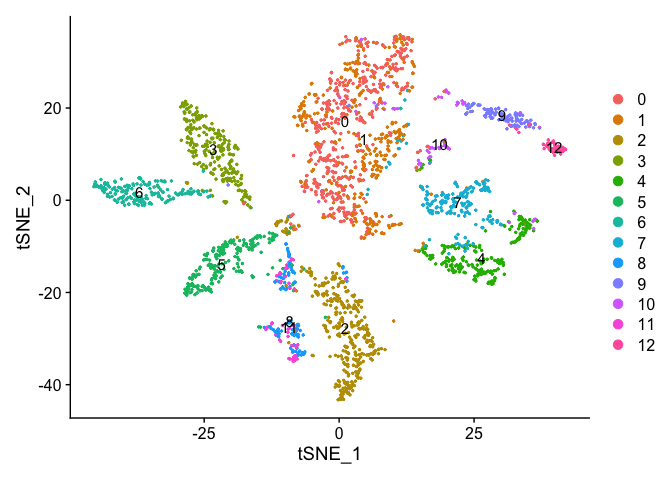<!-- -->


Plot TSNE coloring by the clustering resolution 4

```r
DimPlot(object = experiment.aggregate, group.by="RNA_snn_res.4", pt.size=0.5, reduction = "tsne", label = T)
```

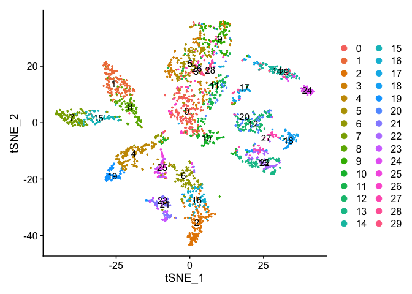<!-- -->

uMAP dimensionality reduction plot.


```r
experiment.aggregate <- RunUMAP(
  object = experiment.aggregate,
  dims = use.pcs)
```

```
## Warning: The default method for RunUMAP has changed from calling Python UMAP via reticulate to the R-native UWOT using the cosine metric
## To use Python UMAP via reticulate, set umap.method to 'umap-learn' and metric to 'correlation'
## This message will be shown once per session
```

```
## 07:41:54 UMAP embedding parameters a = 0.9922 b = 1.112
```

```
## 07:41:54 Read 2681 rows and found 29 numeric columns
```

```
## 07:41:54 Using Annoy for neighbor search, n_neighbors = 30
```

```
## 07:41:54 Building Annoy index with metric = cosine, n_trees = 50
```

```
## 0%   10   20   30   40   50   60   70   80   90   100%
```

```
## [----|----|----|----|----|----|----|----|----|----|
```

```
## **************************************************|
## 07:41:55 Writing NN index file to temp file /var/folders/74/h45z17f14l9g34tmffgq9nkw0000gn/T//RtmpvxH7UJ/file9d173360a454
## 07:41:55 Searching Annoy index using 1 thread, search_k = 3000
## 07:41:55 Annoy recall = 100%
## 07:41:55 Commencing smooth kNN distance calibration using 1 thread
## 07:41:56 Initializing from normalized Laplacian + noise
## 07:41:56 Commencing optimization for 500 epochs, with 107536 positive edges
## 07:41:59 Optimization finished
```

Plot uMap coloring by the slot 'ident' (default).

```r
DimPlot(object = experiment.aggregate, pt.size=0.5, reduction = "umap", label = T)
```

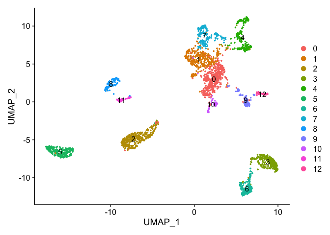<!-- -->


FeaturePlot can be used to color cells with a 'feature', non categorical data, like number of UMIs

```r
FeaturePlot(experiment.aggregate, features = c('nCount_RNA'), pt.size=0.5)
```

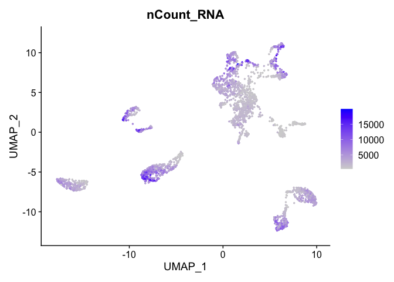<!-- -->
and number of genes present

```r
FeaturePlot(experiment.aggregate, features = c('nFeature_RNA'), pt.size=0.5)
```

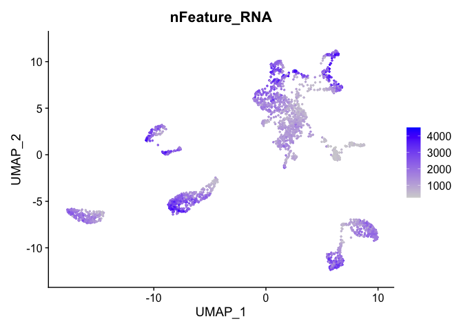<!-- -->

percent mitochondrial 

```r
FeaturePlot(experiment.aggregate, features = c('percent.mito'), pt.size=0.5)
```

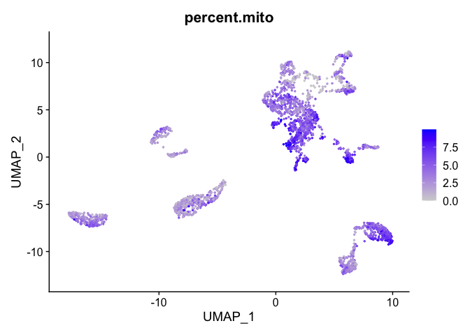<!-- -->

TSNE plot by cell cycle

```r
DimPlot(object = experiment.aggregate, pt.size=0.5, group.by = "cell.cycle", reduction = "tsne" )
```

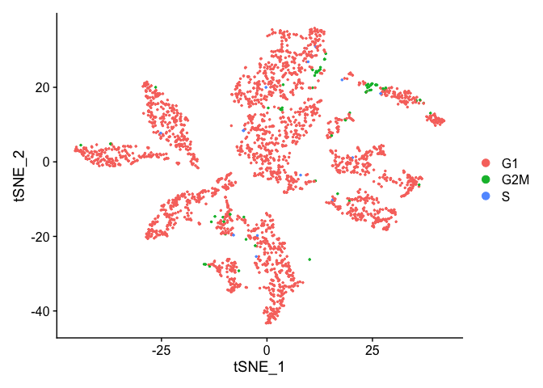<!-- -->


## Building  a  tree relating the 'average' cell from each cluster. Tree is estimated based on a distance matrix constructed in either gene expression space or PCA space.


```r
experiment.aggregate <- BuildClusterTree(
  experiment.aggregate, dims = use.pcs)

PlotClusterTree(experiment.aggregate)
```

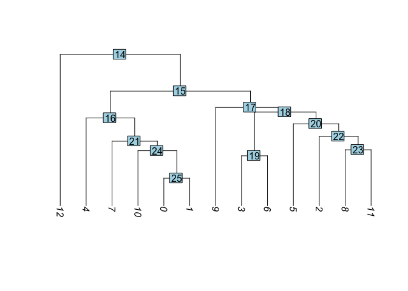<!-- -->


```r
DimPlot(object = experiment.aggregate, pt.size=0.5, label = TRUE, reduction = "tsne")
```

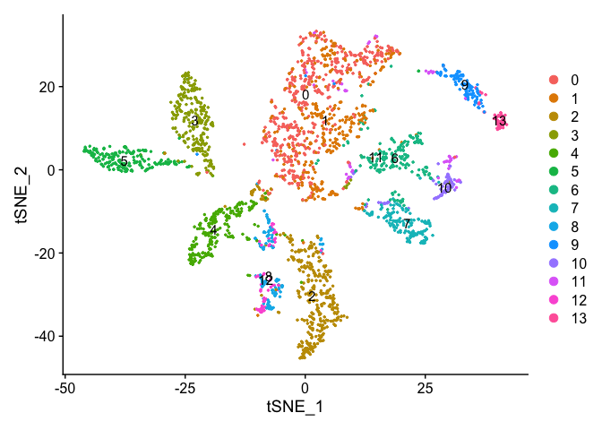<!-- -->

Merge Clustering results

```r
experiment.merged = experiment.aggregate
# originally set clusters to resolutionm 0.5
Idents(experiment.merged) <- "RNA_snn_res.0.5"

table(Idents(experiment.merged))
```

```
## 
##   0   1   2   3   4   5   6   7   8   9  10  11  12  13 
## 484 369 355 268 218 192 192 145 107 105  70  66  57  53
```

```r
# based on TSNE and Heirarchical tree
# merge clusters 6 and 7 into 0 and cluster 9 into 13
experiment.merged <- RenameIdents(
  object = experiment.merged,
  '6' = '0', '7' = '0', '9' = '13'
)

table(Idents(experiment.merged))
```

```
## 
##   0  13   1   2   3   4   5   8  10  11  12 
## 821 158 369 355 268 218 192 107  70  66  57
```

```r
DimPlot(object = experiment.merged, pt.size=0.5, label = T, reduction = "tsne")
```

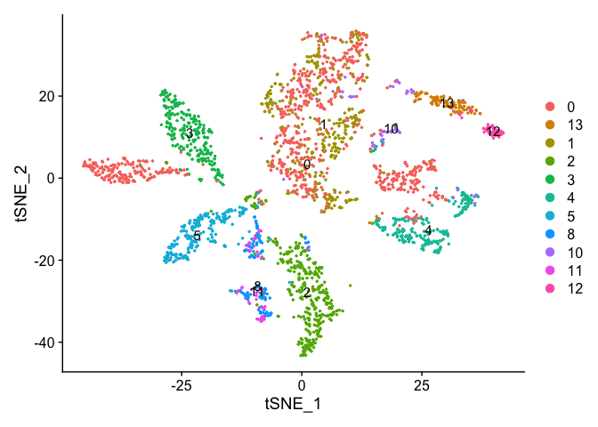<!-- -->

```r
experiment.examples <- experiment.merged
# in order to reporder the clusters for plotting purposes
# take a look at the levels, which indicates the ordering
levels(experiment.examples@active.ident)
```

```
##  [1] "0"  "13" "1"  "2"  "3"  "4"  "5"  "8"  "10" "11" "12"
```

```r
# relevel setting 5 to the first factor
experiment.examples@active.ident <- relevel(experiment.examples@active.ident, "5")
levels(experiment.examples@active.ident)
```

```
##  [1] "5"  "0"  "13" "1"  "2"  "3"  "4"  "8"  "10" "11" "12"
```

```r
# now cluster 5 is the "first" factor

# relevel all the factors to the order I want
Idents(experiment.examples) <- factor(experiment.examples@active.ident, levels=c("5","13","1","2","3","0","4","8","11","12","10","14"))
levels(experiment.examples@active.ident)
```

```
##  [1] "5"  "13" "1"  "2"  "3"  "0"  "4"  "8"  "11" "12" "10"
```

```r
DimPlot(object = experiment.examples, pt.size=0.5, label = T, reduction = "tsne")
```

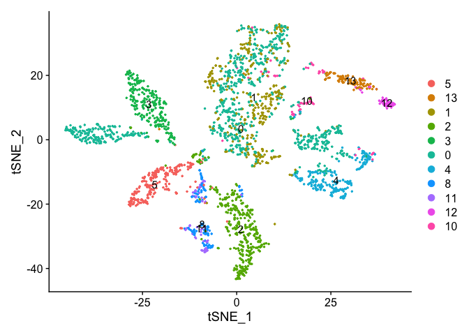<!-- -->

```r
### Re-assign clustering result to resolution 4 for cells in cluster 0 (@ reslution 0.5) [adding a R prefix]
newIdent = as.character(Idents(experiment.examples))
newIdent[newIdent == '0'] = paste0("R",as.character(experiment.examples$RNA_snn_res.4[newIdent == '0']))

Idents(experiment.examples) <- as.factor(newIdent)

table(Idents(experiment.examples))
```

```
## 
##   1  10  11  12  13   2   3   4   5   8  R1 R10 R11 R12 R13 R14 R16 R20 R21 R26 
## 369  70  66  57 158 355 268 218 192 107 172   2   1  92  83   1   5  59  58  42 
## R27 R28  R6  R8  R9 
##  32   1 145 105  23
```

```r
DimPlot(object = experiment.examples, pt.size=0.5, label = T, reduction = "tsne")
```

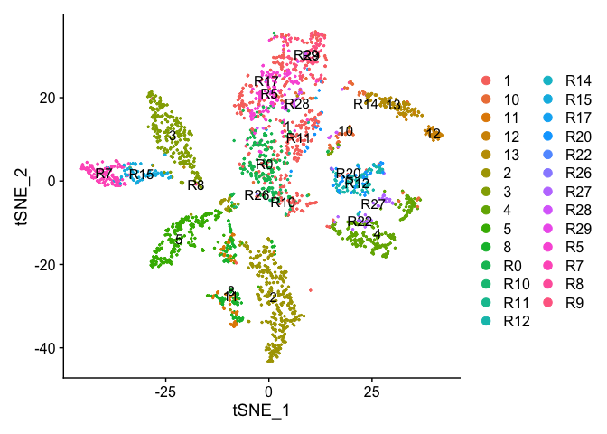<!-- -->

Plot TSNE coloring by the slot 'orig.ident' (sample names) with alpha colors turned on.

```r
DimPlot(object = experiment.aggregate, group.by="orig.ident", pt.size=0.5, reduction = "tsne" )
```

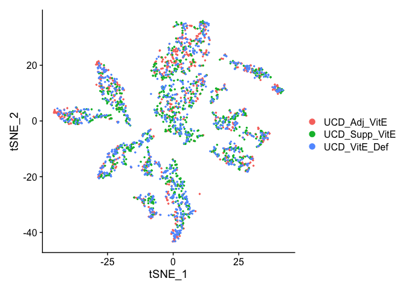<!-- -->

```r
## Pretty tsne using alpha
p <- DimPlot(object = experiment.aggregate, group.by="orig.ident", pt.size=0.5, reduction = "tsne")
alpha.use <- 2/5
p$layers[[1]]$mapping$alpha <- alpha.use
p + scale_alpha_continuous(range = alpha.use, guide = F)
```

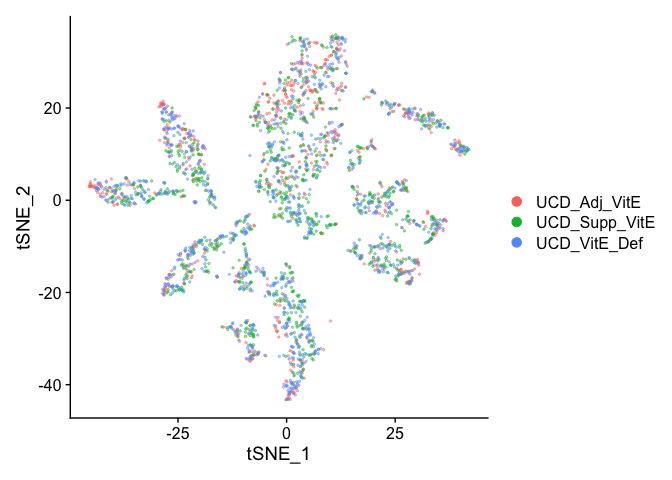<!-- -->

Removing cells assigned to clusters from a plot, So here plot all clusters but clusters "3" and "5"

```r
# create a new tmp object with those removed 
experiment.aggregate.tmp <- experiment.aggregate[,-which(Idents(experiment.aggregate) %in% c("3","5"))]

dim(experiment.aggregate)
```

```
## [1] 12811  2681
```

```r
dim(experiment.aggregate.tmp)
```

```
## [1] 12811  2221
```

```r
DimPlot(object = experiment.aggregate.tmp, group.by="orig.ident", pt.size=0.5, reduction = "tsne", label = T)
```

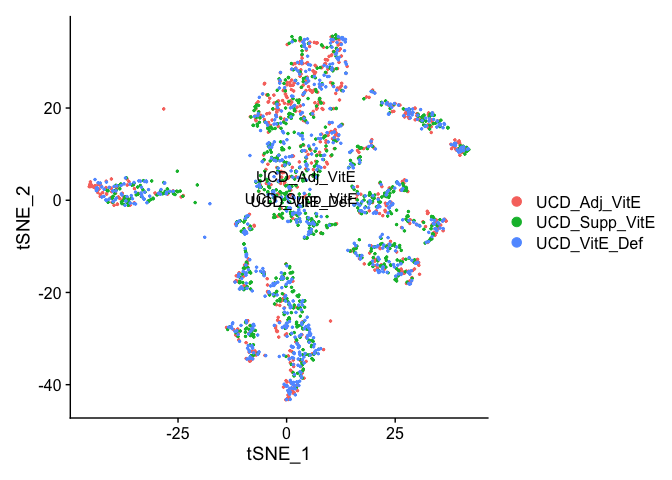<!-- -->

## Identifying Marker Genes

Seurat can help you find markers that define clusters via differential expression.

`FindMarkers` identifies markers for a cluster relative to all other clusters.

`FindAllMarkers` does so for all clusters

`FindAllMarkersNode` defines all markers that split a Node __(Warning: need to validate)__


```r
?FindMarkers

markers = FindMarkers(experiment.merged, ident.1=c(10), genes.use = VariableFeatures(experiment.merged))

head(markers)
```

```
##                  p_val avg_logFC pct.1 pct.2     p_val_adj
## Baiap2l1 7.352739e-235 1.1954540 0.714 0.014 9.419593e-231
## Cadps2   4.448365e-198 2.3426788 0.971 0.051 5.698801e-194
## Tbx3os2  1.753416e-182 0.6699683 0.443 0.005 2.246301e-178
## Cbln2    1.849806e-152 1.1941476 0.786 0.038 2.369787e-148
## Ntng1    1.302871e-150 1.0795688 0.686 0.028 1.669108e-146
## Ntrk2    1.157467e-148 2.0506117 0.971 0.074 1.482831e-144
```

```r
dim(markers)
```

```
## [1] 1474    5
```

```r
table(markers$avg_logFC > 0)
```

```
## 
## FALSE  TRUE 
##   688   786
```

 
pct.1 and pct.2 are the proportion of cells with expression above 0 in ident.1 and ident.2 respectively. p_val is the raw p_value associated with the differntial expression test with adjusted value in p_val_adj. avg_logFC is the average log fold change difference between the two groups. 
 
avg_diff (lines 130, 193 and) appears to be the difference in log(x = mean(x = exp(x = x) - 1) + 1) between groups.  It doesn’t seem like this should work out to be the signed ratio of pct.1 to pct.2 so I must be missing something.  It doesn’t seem to be related at all to how the p-values are calculated so maybe it doesn’t matter so much, and the sign is probably going to be pretty robust to how expression is measured.

Can use a violin plot to visualize the expression pattern of some markers

```r
VlnPlot(object = experiment.merged, features = rownames(markers)[1:2], pt.size = 0.05)
```

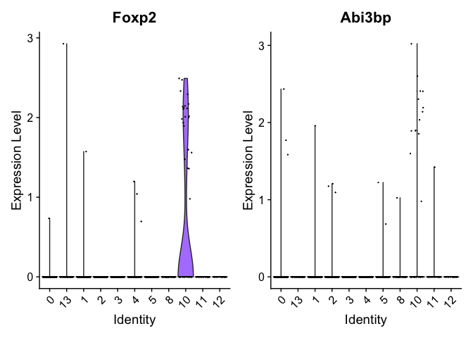<!-- -->

Or a feature plot

```r
FeaturePlot(
    experiment.merged, 
    head(rownames(markers), n=6), 
    cols = c("lightgrey", "blue"), 
    ncol = 2
)
```

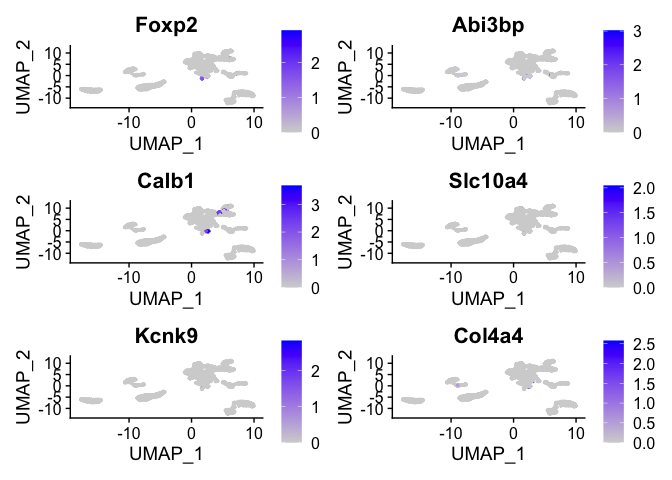<!-- -->

```r
FeaturePlot(    
    experiment.merged, 
    "Fxyd1", 
    cols = c("lightgrey", "blue") 
)
```

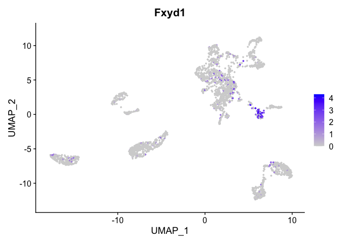<!-- -->

FindAllMarkers can be used to automate the process across all genes.
__WARNING: TAKES A LONG TIME TO RUN__


```r
markers_all <- FindAllMarkers(
    object = experiment.merged, 
    only.pos = TRUE, 
    min.pct = 0.25, 
    thresh.use = 0.25
)
```

```
## Calculating cluster 0
```

```
## Calculating cluster 13
```

```
## Calculating cluster 1
```

```
## Calculating cluster 2
```

```
## Calculating cluster 3
```

```
## Calculating cluster 4
```

```
## Calculating cluster 5
```

```
## Calculating cluster 8
```

```
## Calculating cluster 10
```

```
## Calculating cluster 11
```

```
## Calculating cluster 12
```

```r
dim(markers_all)
```

```
## [1] 4558    7
```

```r
head(markers_all)
```

```
##                 p_val avg_logFC pct.1 pct.2     p_val_adj cluster    gene
## Fxyd7   1.080507e-195 1.8236300 0.622 0.095 1.384238e-191       0   Fxyd7
## Epb41l3 8.105698e-137 0.9447680 0.886 0.646 1.038421e-132       0 Epb41l3
## Pcp4    8.134008e-117 1.1867777 0.622 0.202 1.042048e-112       0    Pcp4
## Syt2     4.075036e-95 0.7285700 0.317 0.034  5.220529e-91       0    Syt2
## Ppp3ca   7.953394e-94 0.7186081 0.932 0.827  1.018909e-89       0  Ppp3ca
## Map1b    7.038770e-93 0.7138478 0.906 0.834  9.017368e-89       0   Map1b
```

```r
table(table(markers_all$gene))
```

```
## 
##    1    2    3    4    5    6 
## 1460  735  355  107   21    5
```

```r
markers_all_single <- markers_all[markers_all$gene %in% names(table(markers_all$gene))[table(markers_all$gene) == 1],]

dim(markers_all_single)
```

```
## [1] 1460    7
```

```r
table(table(markers_all_single$gene))
```

```
## 
##    1 
## 1460
```

```r
table(markers_all_single$cluster)
```

```
## 
##   0  13   1   2   3   4   5   8  10  11  12 
##  98 102  93 113 101 143 259  51 372  16 112
```

```r
head(markers_all_single)
```

```
##               p_val avg_logFC pct.1 pct.2    p_val_adj cluster   gene
## Syt2   4.075036e-95 0.7285700 0.317 0.034 5.220529e-91       0   Syt2
## Map1b  7.038770e-93 0.7138478 0.906 0.834 9.017368e-89       0  Map1b
## Pou4f3 3.681679e-70 0.7213944 0.253 0.032 4.716599e-66       0 Pou4f3
## Faim2  1.249016e-64 0.6612418 0.262 0.041 1.600115e-60       0  Faim2
## Clec2l 1.678623e-56 0.9394917 0.252 0.048 2.150484e-52       0 Clec2l
## Bcl11b 4.229328e-55 0.6431914 0.263 0.053 5.418192e-51       0 Bcl11b
```

Plot a heatmap of genes by cluster for the top 5 marker genes per cluster

```r
library(dplyr)
```

```
## 
## Attaching package: 'dplyr'
```

```
## The following objects are masked from 'package:stats':
## 
##     filter, lag
```

```
## The following objects are masked from 'package:base':
## 
##     intersect, setdiff, setequal, union
```

```r
top5 <- markers_all_single %>% group_by(cluster) %>% top_n(5, avg_logFC)
dim(top5)
```

```
## [1] 55  7
```

```r
DoHeatmap(
    object = experiment.merged, 
    features = top5$gene
) 
```

```
## Warning in DoHeatmap(object = experiment.merged, features = top5$gene): The
## following features were omitted as they were not found in the scale.data slot
## for the RNA assay: Mest, Chd5, Nwd2, Pik3r1, Nrsn1, Nrip1
```

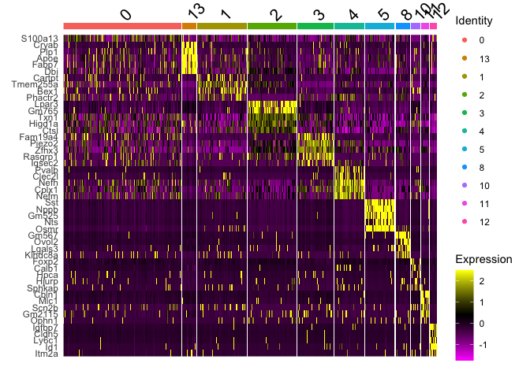<!-- -->


```r
# Get expression of genes for cells in and out of each cluster
getGeneClusterMeans <- function(gene, cluster){
  x <- GetAssayData(experiment.merged)[gene,]
  m <- tapply(x, ifelse(Idents(experiment.merged) == cluster, 1, 0), mean)
  mean.in.cluster <- m[2]
  mean.out.of.cluster <- m[1]
  return(list(mean.in.cluster = mean.in.cluster, mean.out.of.cluster = mean.out.of.cluster))
}

## for sake of time only using first six (head)
means <- mapply(getGeneClusterMeans, head(markers_all[,"gene"]), head(markers_all[,"cluster"]))
means <- matrix(unlist(means), ncol = 2, byrow = T)

colnames(means) <- c("mean.in.cluster", "mean.out.of.cluster")
rownames(means) <- head(markers_all[,"gene"])
markers_all2 <- cbind(head(markers_all), means)
head(markers_all2)
```

```
##                 p_val avg_logFC pct.1 pct.2     p_val_adj cluster    gene
## Fxyd7   1.080507e-195 1.8236300 0.622 0.095 1.384238e-191       0   Fxyd7
## Epb41l3 8.105698e-137 0.9447680 0.886 0.646 1.038421e-132       0 Epb41l3
## Pcp4    8.134008e-117 1.1867777 0.622 0.202 1.042048e-112       0    Pcp4
## Syt2     4.075036e-95 0.7285700 0.317 0.034  5.220529e-91       0    Syt2
## Ppp3ca   7.953394e-94 0.7186081 0.932 0.827  1.018909e-89       0  Ppp3ca
## Map1b    7.038770e-93 0.7138478 0.906 0.834  9.017368e-89       0   Map1b
##         mean.in.cluster mean.out.of.cluster
## Fxyd7         1.6798649          0.19407543
## Epb41l3       2.3404669          1.23177418
## Pcp4          1.7363581          0.46152834
## Syt2          0.4960596          0.05270559
## Ppp3ca        2.8546865          1.98236564
## Map1b         2.8048819          2.04237303
```

## Finishing up clusters.

At this point in time you should use the tree, markers, domain knowledge, and goals to finalize your clusters. This may mean adjusting PCA to use, mergers clusters together, choosing a new resolutions, etc. When finished you can further name it cluster by something more informative. Ex.

```r
experiment.clusters <- experiment.aggregate
experiment.clusters <- RenameIdents(
  object = experiment.clusters,
  '0' = 'cell_type_A',
  '1' = 'cell_type_B',
  '2' = 'cell_type_C'
)
# and so on

DimPlot(object = experiment.clusters, pt.size=0.5, label = T, reduction = "tsne")
```

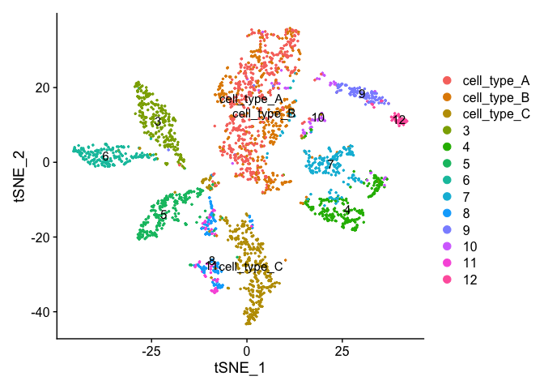<!-- -->

```r
experiment.merged$finalcluster <- Idents(experiment.merged)
```

## Subsetting samples
If you want to look at the representation of just one sample, or sets of samples

```r
experiment.sample2 <- subset(experiment.merged, orig.ident == "UCD_Supp_VitE")

DimPlot(object = experiment.sample2, group.by = "RNA_snn_res.0.5", pt.size=0.5, label = TRUE, reduction = "tsne")
```

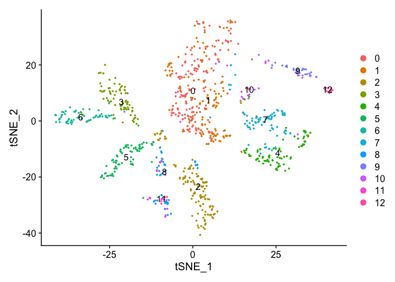<!-- -->

```r
FeaturePlot(experiment.sample2, features =c('Calca'), pt.size=0.5)
```

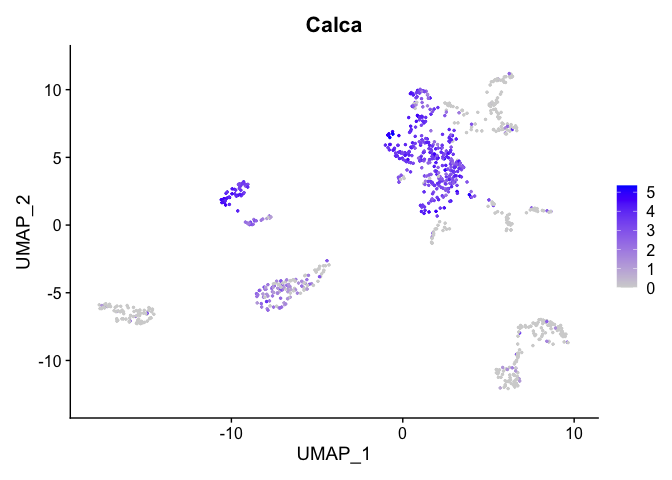<!-- -->

```r
FeaturePlot(experiment.sample2, features =c('Adcyap1'), pt.size=0.5)
```

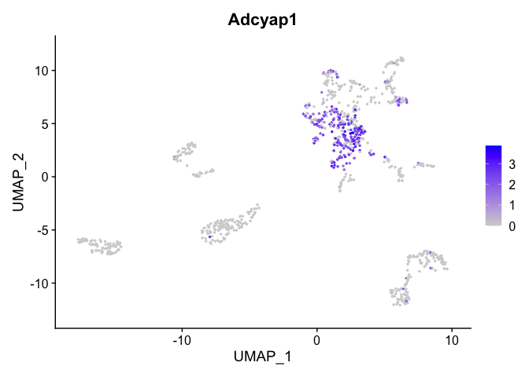<!-- -->

```r
experiment.batch1 <- subset(experiment.merged, batchid == "Batch1")

DimPlot(object = experiment.batch1, group.by = "RNA_snn_res.0.5", pt.size=0.5, label = TRUE, reduction = "tsne")
```

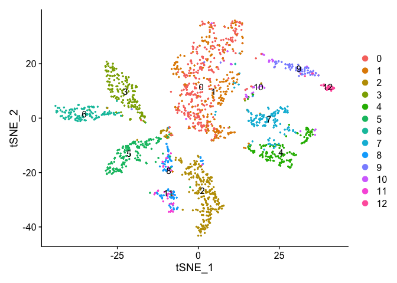<!-- -->

### Adding in a new metadata column representing samples within clusters


```r
experiment.merged$samplecluster = paste(experiment.merged$orig.ident,experiment.merged$finalcluster,sep = '-')

# set the identity to the new variable 
Idents(experiment.merged) <- "samplecluster"

markers.comp <- FindMarkers(experiment.merged, ident.1 = "UCD_Adj_VitE-0", ident.2= c("UCD_Supp_VitE-0","UCD_VitE_Def-0"))

markers.comp
```

```
##                 p_val  avg_logFC pct.1 pct.2    p_val_adj
## Actb     8.861881e-10 -0.5673947 0.992 0.977 1.135296e-05
## Rpl21    7.774848e-08  0.3881549 0.864 0.706 9.960357e-04
## Pcp4     4.741533e-07  0.4131801 0.735 0.571 6.074377e-03
## Rpl23a   2.021054e-06  0.2894962 0.895 0.766 2.589172e-02
## Rpl17    2.608916e-06  0.2684048 0.860 0.722 3.342283e-02
## Eif3f    1.326337e-05  0.2665792 0.716 0.546 1.699171e-01
## Gpx3     1.765717e-05  0.3159426 0.405 0.243 2.262061e-01
## Wdfy1    2.520164e-05 -0.2918401 0.058 0.167 3.228583e-01
## Arhgap15 3.719021e-05  0.2894767 0.257 0.137 4.764438e-01
## S100a11  4.095142e-05  0.2800170 0.296 0.167 5.246287e-01
## Dbpht2   1.257523e-04  0.2664507 0.381 0.245 1.000000e+00
## Zfp467   2.451262e-04  0.2537192 0.152 0.071 1.000000e+00
## Arf3     9.047709e-04 -0.2881535 0.599 0.649 1.000000e+00
## Abhd2    1.222027e-03 -0.6137435 0.409 0.493 1.000000e+00
## Cartpt   1.472543e-03  0.3209726 0.202 0.115 1.000000e+00
## Polr2f   2.437619e-03  0.2545627 0.253 0.167 1.000000e+00
## Vdac1    3.202511e-03 -0.2773691 0.518 0.574 1.000000e+00
## Mt2      3.830778e-03  0.2982468 0.222 0.140 1.000000e+00
## Ndn      6.667147e-03  0.2547047 0.393 0.303 1.000000e+00
## Cbx3     8.925948e-03 -0.3627569 0.354 0.418 1.000000e+00
## Tagln2   9.775257e-03 -0.2702790 0.066 0.126 1.000000e+00
## Cadm3    1.275191e-02 -0.2684285 0.253 0.326 1.000000e+00
## Pspc1    1.379649e-02 -0.2637400 0.070 0.124 1.000000e+00
## Eno2     1.992050e-02 -0.2610868 0.490 0.543 1.000000e+00
## Necab1   2.091664e-02 -0.3307004 0.148 0.209 1.000000e+00
## Mt1      2.212451e-02  0.2748391 0.580 0.482 1.000000e+00
## Fam168b  2.295118e-02 -0.2826729 0.226 0.285 1.000000e+00
## Lix1     2.510876e-02 -0.3550222 0.237 0.291 1.000000e+00
## S100a16  2.539679e-02 -0.3021223 0.105 0.161 1.000000e+00
## Ptgir    3.874847e-02 -0.2614559 0.070 0.113 1.000000e+00
## Ddhd1    4.619008e-02 -0.2977759 0.187 0.239 1.000000e+00
## Srrm2    5.308238e-02 -0.2572114 0.342 0.388 1.000000e+00
## Rere     5.664667e-02 -0.2638236 0.179 0.230 1.000000e+00
## Clasp2   5.884710e-02 -0.3059209 0.214 0.264 1.000000e+00
## Etv5     6.361715e-02 -0.2762539 0.179 0.225 1.000000e+00
## Zbtb4    6.483122e-02 -0.2652181 0.284 0.328 1.000000e+00
## Birc6    7.223208e-02 -0.2824634 0.163 0.207 1.000000e+00
## Hdlbp    7.359119e-02 -0.3340025 0.222 0.261 1.000000e+00
## Nat8l    8.014531e-02 -0.2993328 0.346 0.381 1.000000e+00
## Ythdf2   1.112498e-01 -0.2643991 0.276 0.312 1.000000e+00
## Nfia     1.960180e-01 -0.2508155 0.323 0.348 1.000000e+00
## Bhlhe41  2.841893e-01 -0.2688964 0.389 0.404 1.000000e+00
## Pam      3.461588e-01 -0.3386852 0.467 0.468 1.000000e+00
## Wtap     3.912595e-01 -0.2518234 0.366 0.372 1.000000e+00
## Setd3    5.982182e-01 -0.2640513 0.323 0.312 1.000000e+00
## Plp1     6.189997e-01 -0.2627386 0.144 0.151 1.000000e+00
```

```r
experiment.subset <- subset(experiment.merged, samplecluster %in%  c( "UCD_Adj_VitE-0", "UCD_Supp_VitE-0" ))
DoHeatmap(experiment.subset, features = rownames(markers.comp))
```

```
## Warning in DoHeatmap(experiment.subset, features = rownames(markers.comp)):
## The following features were omitted as they were not found in the scale.data
## slot for the RNA assay: Setd3, Wtap, Ythdf2, Hdlbp, Birc6, Zbtb4, Clasp2, Rere,
## Srrm2, Ddhd1, Fam168b, Necab1, Pspc1, Vdac1, Polr2f, Arf3, Zfp467, Arhgap15,
## Wdfy1, Eif3f, Rpl17, Rpl23a, Rpl21
```

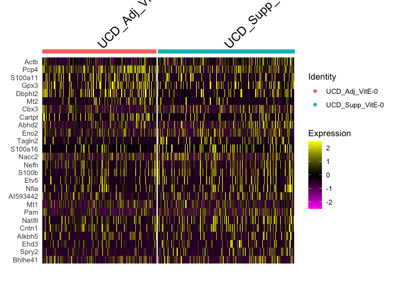<!-- -->

```r
Idents(experiment.merged) <- "finalcluster"
```

And last lets save all the objects in our session.

```r
save(list=ls(), file="clusters_seurat_object.RData")
```

## Get the next Rmd file

```r
download.file("https://raw.githubusercontent.com/ucdavis-bioinformatics-training/2020-Intro_Single_Cell_RNA_Seq/master/data_analysis/scRNA_Workshop-PART6.Rmd", "scRNA_Workshop-PART6.Rmd")
```

## Session Information

```r
sessionInfo()
```

```
## R version 4.0.0 (2020-04-24)
## Platform: x86_64-apple-darwin17.0 (64-bit)
## Running under: macOS Catalina 10.15.4
## 
## Matrix products: default
## BLAS:   /Library/Frameworks/R.framework/Versions/4.0/Resources/lib/libRblas.dylib
## LAPACK: /Library/Frameworks/R.framework/Versions/4.0/Resources/lib/libRlapack.dylib
## 
## locale:
## [1] en_US.UTF-8/en_US.UTF-8/en_US.UTF-8/C/en_US.UTF-8/en_US.UTF-8
## 
## attached base packages:
## [1] stats     graphics  grDevices datasets  utils     methods   base     
## 
## other attached packages:
## [1] dplyr_0.8.5   ggplot2_3.3.0 Seurat_3.1.5 
## 
## loaded via a namespace (and not attached):
##  [1] httr_1.4.1          tidyr_1.0.3         jsonlite_1.6.1     
##  [4] viridisLite_0.3.0   splines_4.0.0       leiden_0.3.3       
##  [7] assertthat_0.2.1    BiocManager_1.30.10 renv_0.10.0        
## [10] yaml_2.2.1          ggrepel_0.8.2       globals_0.12.5     
## [13] pillar_1.4.4        lattice_0.20-41     limma_3.44.1       
## [16] glue_1.4.1          reticulate_1.15     digest_0.6.25      
## [19] RColorBrewer_1.1-2  colorspace_1.4-1    cowplot_1.0.0      
## [22] htmltools_0.4.0     Matrix_1.2-18       plyr_1.8.6         
## [25] pkgconfig_2.0.3     tsne_0.1-3          listenv_0.8.0      
## [28] purrr_0.3.4         patchwork_1.0.0     scales_1.1.1       
## [31] RANN_2.6.1          RSpectra_0.16-0     Rtsne_0.15         
## [34] tibble_3.0.1        farver_2.0.3        ellipsis_0.3.1     
## [37] withr_2.2.0         ROCR_1.0-11         pbapply_1.4-2      
## [40] lazyeval_0.2.2      survival_3.1-12     magrittr_1.5       
## [43] crayon_1.3.4        evaluate_0.14       future_1.17.0      
## [46] nlme_3.1-147        MASS_7.3-51.5       ica_1.0-2          
## [49] tools_4.0.0         fitdistrplus_1.1-1  data.table_1.12.8  
## [52] lifecycle_0.2.0     stringr_1.4.0       plotly_4.9.2.1     
## [55] munsell_0.5.0       cluster_2.1.0       irlba_2.3.3        
## [58] compiler_4.0.0      rsvd_1.0.3          rlang_0.4.6        
## [61] grid_4.0.0          ggridges_0.5.2      RcppAnnoy_0.0.16   
## [64] htmlwidgets_1.5.1   igraph_1.2.5        labeling_0.3       
## [67] rmarkdown_2.1       gtable_0.3.0        codetools_0.2-16   
## [70] reshape2_1.4.4      R6_2.4.1            gridExtra_2.3      
## [73] zoo_1.8-8           knitr_1.28          uwot_0.1.8         
## [76] future.apply_1.5.0  KernSmooth_2.23-16  ape_5.3            
## [79] stringi_1.4.6       parallel_4.0.0      Rcpp_1.0.4.6       
## [82] vctrs_0.3.0         sctransform_0.2.1   png_0.1-7          
## [85] tidyselect_1.1.0    xfun_0.13           lmtest_0.9-37
```
