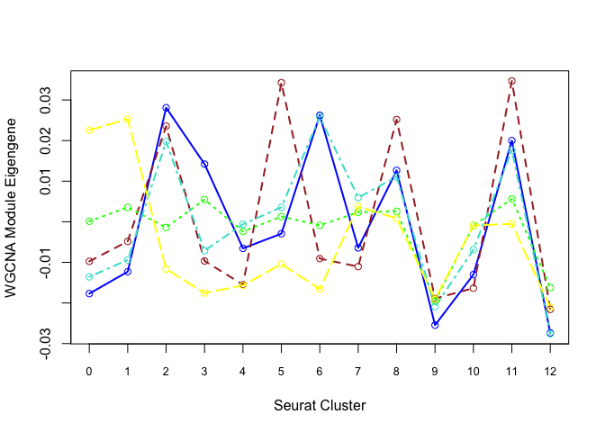
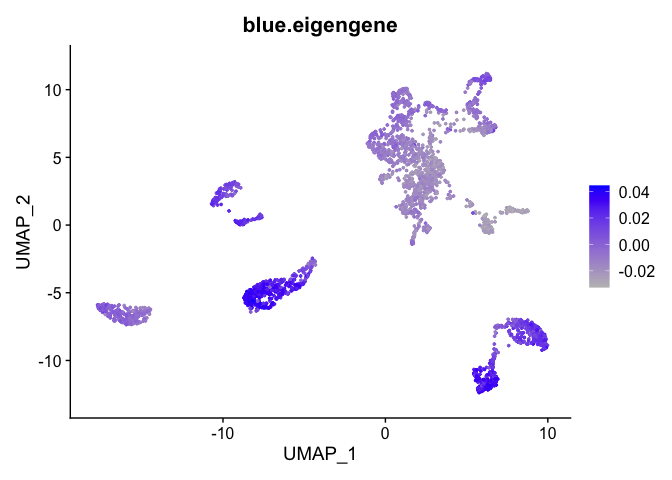

Reminder of samples

* UCD_Adj_VitE
* UCD_Supp_VitE
* UCD_VitE_Def

## Load libraries

```r
library(Seurat)
library(ggplot2)
```

## Load the Seurat object

```r
load("clusters_seurat_object.RData")
experiment.merged
```

```
## An object of class Seurat 
## 12811 features across 2681 samples within 1 assay 
## Active assay: RNA (12811 features, 2000 variable features)
##  3 dimensional reductions calculated: pca, tsne, umap
```

```r
Idents(experiment.merged) <- "RNA_snn_res.0.5"
```


#0. Setup
Load the final Seurat object, load libraries (also see additional required packages for each example)


#1. DE With Single Cell Data Using Limma
For differential expression using models more complex than those allowed by FindAllMarkers(), data from Seurat may be used in limma (https://www.bioconductor.org/packages/devel/bioc/vignettes/limma/inst/doc/usersguide.pdf)

We illustrate by comparing sample 1 to sample 2 within cluster 0:

```r
library(limma)
cluster0 <- subset(experiment.merged, idents = '0')
expr <- as.matrix(GetAssayData(cluster0))

# Filter out genes that are 0 for every cell in this cluster
bad <- which(rowSums(expr) == 0)
expr <- expr[-bad,]

mm <- model.matrix(~0 + orig.ident, data = cluster0@meta.data)
fit <- lmFit(expr, mm)  
head(coef(fit)) # means in each sample for each gene
```

```
##        orig.identUCD_Adj_VitE orig.identUCD_Supp_VitE orig.identUCD_VitE_Def
## Xkr4               0.00000000              0.00000000             0.01244639
## Sox17              0.00000000              0.01668876             0.00000000
## Mrpl15             0.08176912              0.03552368             0.08691244
## Lypla1             0.19102070              0.14361137             0.26607008
## Tcea1              0.20114933              0.21041606             0.20030404
## Rgs20              0.08977786              0.16701617             0.12833534
```

```r
contr <- makeContrasts(orig.identUCD_Supp_VitE - orig.identUCD_Adj_VitE, levels = colnames(coef(fit)))
tmp <- contrasts.fit(fit, contrasts = contr)
tmp <- eBayes(tmp)
topTable(tmp, sort.by = "P", n = 20) # top 20 DE genes
```

```
##              logFC    AveExpr         t      P.Value    adj.P.Val        B
## Rpl21   -0.7556351 2.18376607 -5.855721 8.788450e-09 0.0001042925 9.539390
## Rpl23a  -0.6685951 2.20042706 -5.416089 9.625031e-08 0.0005711012 7.365993
## Pcp4    -0.7945738 1.97307900 -5.080323 5.394231e-07 0.0021337779 5.806565
## Rpl17   -0.6385737 2.03095291 -4.897874 1.324008e-06 0.0035478412 4.996517
## Tmsb10  -0.5075879 3.39483016 -4.872780 1.494835e-06 0.0035478412 4.887183
## Rpl24   -0.5884927 2.10921998 -4.770591 2.437077e-06 0.0048201321 4.447182
## H3f3b   -0.5739244 2.28377746 -4.559194 6.516427e-06 0.0098059796 3.563800
## Rpl39   -0.5473089 2.24828560 -4.556050 6.610587e-06 0.0098059796 3.550936
## Rps15   -0.5665492 1.98366043 -4.336666 1.762107e-05 0.0217259999 2.673438
## Ndufa3  -0.4826286 0.75315056 -4.323873 1.863444e-05 0.0217259999 2.623495
## Rps8    -0.5285119 2.56740433 -4.306059 2.013870e-05 0.0217259999 2.554177
## Rpl32   -0.5363837 2.48366395 -4.272626 2.328052e-05 0.0230224951 2.424792
## Zfp467  -0.2490624 0.16470870 -4.253390 2.529475e-05 0.0230902191 2.350772
## Tshz2   -0.5320498 2.34028483 -4.148785 3.950113e-05 0.0318459666 1.953659
## Tmsb4x  -0.3725442 3.22438235 -4.144250 4.026341e-05 0.0318459666 1.936650
## Alkal2  -0.1394787 0.05510728 -4.128964 4.293718e-05 0.0318459666 1.879445
## Dbpht2  -0.4226453 0.63694021 -3.965965 8.417668e-05 0.0582822357 1.281665
## Rps24   -0.5042936 1.54382120 -3.949370 9.003315e-05 0.0582822357 1.222063
## Rpl10   -0.4695677 2.24688056 -3.940514 9.331444e-05 0.0582822357 1.190352
## S100a10 -0.5110197 1.18692449 -3.917697 1.022983e-04 0.0606987101 1.108955
```
* logFC: log2 fold change (UCD_Supp_VitE/UCD_Adj_VitE)
* AveExpr: Average expression, in log2 counts per million, across all cells included in analysis (i.e. those in cluster 0)
* t: t-statistic, i.e. logFC divided by its standard error
* P.Value: Raw p-value from test that logFC differs from 0
* adj.P.Val: Benjamini-Hochberg false discovery rate adjusted p-value

The limma vignette linked above gives more detail on model specification.

# 2. Gene Ontology (GO) Enrichment of Genes Expressed in a Cluster

```r
library(topGO)
```

```
## Loading required package: BiocGenerics
```

```
## Loading required package: parallel
```

```
## 
## Attaching package: 'BiocGenerics'
```

```
## The following objects are masked from 'package:parallel':
## 
##     clusterApply, clusterApplyLB, clusterCall, clusterEvalQ, clusterExport, clusterMap, parApply, parCapply, parLapply, parLapplyLB, parRapply, parSapply, parSapplyLB
```

```
## The following object is masked from 'package:limma':
## 
##     plotMA
```

```
## The following objects are masked from 'package:stats':
## 
##     IQR, mad, sd, var, xtabs
```

```
## The following objects are masked from 'package:base':
## 
##     anyDuplicated, append, as.data.frame, basename, cbind, colnames, dirname, do.call, duplicated, eval, evalq, Filter, Find, get, grep, grepl, intersect, is.unsorted, lapply, Map, mapply, match, mget, order, paste, pmax, pmax.int, pmin, pmin.int, Position, rank, rbind, Reduce, rownames, sapply, setdiff, sort, table, tapply, union, unique, unsplit, which, which.max, which.min
```

```
## Loading required package: graph
```

```
## Loading required package: Biobase
```

```
## Welcome to Bioconductor
## 
##     Vignettes contain introductory material; view with 'browseVignettes()'. To cite Bioconductor, see 'citation("Biobase")', and for packages 'citation("pkgname")'.
```

```
## Loading required package: GO.db
```

```
## Loading required package: AnnotationDbi
```

```
## Loading required package: stats4
```

```
## Loading required package: IRanges
```

```
## Loading required package: S4Vectors
```

```
## 
## Attaching package: 'S4Vectors'
```

```
## The following object is masked from 'package:base':
## 
##     expand.grid
```

```
## 
```

```
## Loading required package: SparseM
```

```
## 
## Attaching package: 'SparseM'
```

```
## The following object is masked from 'package:base':
## 
##     backsolve
```

```
## 
## groupGOTerms: 	GOBPTerm, GOMFTerm, GOCCTerm environments built.
```

```
## 
## Attaching package: 'topGO'
```

```
## The following object is masked from 'package:IRanges':
## 
##     members
```

```r
# install org.Mm.eg.db from Bioconductor if not already installed (for mouse only)
cluster0 <- subset(experiment.merged, idents = '0')
expr <- as.matrix(GetAssayData(cluster0))
# Select genes that are expressed > 0 in at least 75% of cells (somewhat arbitrary definition)
n.gt.0 <- apply(expr, 1, function(x)length(which(x > 0)))
expressed.genes <- rownames(expr)[which(n.gt.0/ncol(expr) >= 0.75)]
all.genes <- rownames(expr)

# define geneList as 1 if gene is in expressed.genes, 0 otherwise
geneList <- ifelse(all.genes %in% expressed.genes, 1, 0)
names(geneList) <- all.genes

# Create topGOdata object
	GOdata <- new("topGOdata",
		ontology = "BP", # use biological process ontology
		allGenes = geneList,
		geneSelectionFun = function(x)(x == 1),
              annot = annFUN.org, mapping = "org.Mm.eg.db", ID = "symbol")
```

```
## 
## Building most specific GOs .....
```

```
## Loading required package: org.Mm.eg.db
```

```
## 
```

```
## 	( 10610 GO terms found. )
```

```
## 
## Build GO DAG topology ..........
```

```
## 	( 14634 GO terms and 34710 relations. )
```

```
## 
## Annotating nodes ...............
```

```
## 	( 11709 genes annotated to the GO terms. )
```

```r
# Test for enrichment using Fisher's Exact Test
	resultFisher <- runTest(GOdata, algorithm = "elim", statistic = "fisher")
```

```
## 
## 			 -- Elim Algorithm -- 
## 
## 		 the algorithm is scoring 2871 nontrivial nodes
## 		 parameters: 
## 			 test statistic: fisher
## 			 cutOff: 0.01
```

```
## 
## 	 Level 19:	1 nodes to be scored	(0 eliminated genes)
```

```
## 
## 	 Level 18:	1 nodes to be scored	(0 eliminated genes)
```

```
## 
## 	 Level 17:	1 nodes to be scored	(0 eliminated genes)
```

```
## 
## 	 Level 16:	6 nodes to be scored	(0 eliminated genes)
```

```
## 
## 	 Level 15:	16 nodes to be scored	(0 eliminated genes)
```

```
## 
## 	 Level 14:	32 nodes to be scored	(24 eliminated genes)
```

```
## 
## 	 Level 13:	72 nodes to be scored	(31 eliminated genes)
```

```
## 
## 	 Level 12:	108 nodes to be scored	(429 eliminated genes)
```

```
## 
## 	 Level 11:	178 nodes to be scored	(762 eliminated genes)
```

```
## 
## 	 Level 10:	255 nodes to be scored	(790 eliminated genes)
```

```
## 
## 	 Level 9:	324 nodes to be scored	(1362 eliminated genes)
```

```
## 
## 	 Level 8:	377 nodes to be scored	(1501 eliminated genes)
```

```
## 
## 	 Level 7:	453 nodes to be scored	(1913 eliminated genes)
```

```
## 
## 	 Level 6:	442 nodes to be scored	(2135 eliminated genes)
```

```
## 
## 	 Level 5:	323 nodes to be scored	(2181 eliminated genes)
```

```
## 
## 	 Level 4:	180 nodes to be scored	(2184 eliminated genes)
```

```
## 
## 	 Level 3:	83 nodes to be scored	(2794 eliminated genes)
```

```
## 
## 	 Level 2:	18 nodes to be scored	(2794 eliminated genes)
```

```
## 
## 	 Level 1:	1 nodes to be scored	(2794 eliminated genes)
```

```r
	GenTable(GOdata, Fisher = resultFisher, topNodes = 20, numChar = 60)
```

```
##         GO.ID                                                            Term Annotated Significant Expected  Fisher
## 1  GO:0002181                                         cytoplasmic translation        79          19     0.92 2.7e-20
## 2  GO:0006412                                                     translation       518          50     6.06 3.5e-18
## 3  GO:0000028                                ribosomal small subunit assembly        18           7     0.21 7.4e-10
## 4  GO:0000027                                ribosomal large subunit assembly        29           7     0.34 3.2e-08
## 5  GO:0097214          positive regulation of lysosomal membrane permeability         2           2     0.02 0.00014
## 6  GO:0006880                          intracellular sequestering of iron ion         2           2     0.02 0.00014
## 7  GO:0002227                                innate immune response in mucosa         2           2     0.02 0.00014
## 8  GO:0000462 maturation of SSU-rRNA from tricistronic rRNA transcript (SS...        30           4     0.35 0.00039
## 9  GO:0061844 antimicrobial humoral immune response mediated by antimicrob...        14           3     0.16 0.00052
## 10 GO:0016198                                   axon choice point recognition         4           2     0.05 0.00080
## 11 GO:0071635 negative regulation of transforming growth factor beta produ...         5           2     0.06 0.00133
## 12 GO:0006605                                               protein targeting       230           9     2.69 0.00151
## 13 GO:0002679                  respiratory burst involved in defense response         6           2     0.07 0.00198
## 14 GO:1902255 positive regulation of intrinsic apoptotic signaling pathway...         6           2     0.07 0.00198
## 15 GO:1905323                          telomerase holoenzyme complex assembly         6           2     0.07 0.00198
## 16 GO:0007409                                                    axonogenesis       357          13     4.18 0.00256
## 17 GO:1904667        negative regulation of ubiquitin protein ligase activity         7           2     0.08 0.00275
## 18 GO:0071637         regulation of monocyte chemotactic protein-1 production         7           2     0.08 0.00275
## 19 GO:0019731                                  antibacterial humoral response         7           2     0.08 0.00275
## 20 GO:0007612                                                        learning       124           6     1.45 0.00332
```
* Annotated: number of genes (out of all.genes) that are annotated with that GO term
* Significant: number of genes that are annotated with that GO term and meet our criteria for "expressed"
* Expected: Under random chance, number of genes that would be expected to be annotated with that GO term and meeting our criteria for "expressed"
* Fisher: (Raw) p-value from Fisher's Exact Test

#3. Weighted Gene Co-Expression Network Analysis (WGCNA)
WGCNA identifies groups of genes ("modules") with correlated expression.
WARNING: TAKES A LONG TIME TO RUN

```r
library(WGCNA)
```

```
## Loading required package: dynamicTreeCut
```

```
## Loading required package: fastcluster
```

```
## 
## Attaching package: 'fastcluster'
```

```
## The following object is masked from 'package:stats':
## 
##     hclust
```

```
## 
## Attaching package: 'WGCNA'
```

```
## The following object is masked from 'package:IRanges':
## 
##     cor
```

```
## The following object is masked from 'package:S4Vectors':
## 
##     cor
```

```
## The following object is masked from 'package:stats':
## 
##     cor
```

```r
options(stringsAsFactors = F)
datExpr <- t(as.matrix(GetAssayData(experiment.merged)))[,VariableFeatures(experiment.merged)]  # only use variable genes in analysis

net <- blockwiseModules(datExpr, power = 10,
  corType = "bicor", # use robust correlation
	networkType = "signed", minModuleSize = 10,
	reassignThreshold = 0, mergeCutHeight = 0.15,
	numericLabels = F, pamRespectsDendro = FALSE,
	saveTOMs = TRUE,
	saveTOMFileBase = "TOM",
	verbose = 3)
```

```
##  Calculating module eigengenes block-wise from all genes
##    Flagging genes and samples with too many missing values...
##     ..step 1
##  ..Working on block 1 .
##     TOM calculation: adjacency..
##     ..will not use multithreading.
##      Fraction of slow calculations: 0.000000
##     ..connectivity..
##     ..matrix multiplication (system BLAS)..
##     ..normalization..
##     ..done.
##    ..saving TOM for block 1 into file TOM-block.1.RData
##  ....clustering..
##  ....detecting modules..
##  ....calculating module eigengenes..
##  ....checking kME in modules..
##      ..removing 67 genes from module 1 because their KME is too low.
##      ..removing 43 genes from module 3 because their KME is too low.
##      ..removing 2 genes from module 12 because their KME is too low.
##  ..merging modules that are too close..
##      mergeCloseModules: Merging modules whose distance is less than 0.15
##        Calculating new MEs...
```

```r
table(net$colors)
```

```
## 
##     black      blue     brown     green      grey       red turquoise    yellow 
##        11        80        21        12      1536        11       312        17
```

```r
# Convert labels to colors for plotting
mergedColors = net$colors
# Plot the dendrogram and the module colors underneath
plotDendroAndColors(net$dendrograms[[1]], mergedColors[net$blockGenes[[1]]],
"Module colors",
dendroLabels = FALSE, hang = 0.03,
addGuide = TRUE, guideHang = 0.05)
```

<!-- -->
Genes in grey module are unclustered.

What genes are in the "blue" module?

```r
colnames(datExpr)[net$colors == "blue"]
```

```
##  [1] "Lxn"           "Txn1"          "Grik1"         "Fez1"          "Tmem45b"       "Synpr"         "Tceal9"        "Ppp1r1a"       "Rgs10"         "Nrn1"          "Fxyd2"         "Ostf1"         "Lix1"          "Sncb"          "Paqr5"         "Bex3"          "Anxa5"         "Gfra2"         "Scg3"          "Ppm1j"         "Kcnab1"        "Kcnip4"        "Cadm1"         "Isl2"          "Pla2g7"        "Tppp3"         "Rgs4"         
## [28] "Tmsb4x"        "Unc119"        "Pmm1"          "Ccdc68"        "Rnf7"          "Prr13"         "Rsu1"          "Pmp22"         "Acpp"          "Kcnip2"        "Cdk15"         "Mrps6"         "Ebp"           "Hexb"          "Cdh11"         "Dapk2"         "Ano3"          "Pde6d"         "Snx7"          "Dtnbp1"        "Tubb2b"        "Nr2c2ap"       "Phf24"         "Rcan2"         "Fam241b"       "Pmvk"          "Slc25a4"      
## [55] "Zfhx3"         "Dgkz"          "Ndufv1"        "Ptrh1"         "1700037H04Rik" "Kif5b"         "Sae1"          "Sri"           "Cpne3"         "Dgcr6"         "Cisd3"         "Syt7"          "Lhfpl3"        "Dda1"          "Ppp1ca"        "Glrx3"         "Stoml1"        "Plagl1"        "Lbh"           "Degs1"         "AI413582"      "Car10"         "Tlx2"          "Parm1"         "March11"       "Cpe"
```

Each cluster is represented by a summary "eigengene".
Plot eigengenes for each non-grey module by clusters from Seurat:

```r
f <- function(module){
  eigengene <- unlist(net$MEs[paste0("ME", module)])
  means <- tapply(eigengene, Idents(experiment.merged), mean, na.rm = T)
  return(means)
}
modules <- c("blue", "brown", "green", "turquoise", "yellow")
plotdat <- sapply(modules, f)
matplot(plotdat, col = modules, type = "l", lwd = 2, xaxt = "n", xlab = "Seurat Cluster",
        ylab = "WGCNA Module Eigengene")
axis(1, at = 1:19, labels = 0:18, cex.axis = 0.8)
matpoints(plotdat, col = modules, pch = 21)
```

<!-- -->

Can also plot the module onto the tsne plot

```r
blue.eigengene <- unlist(net$MEs[paste0("ME", "blue")])
names(blue.eigengene) <- rownames(datExpr)
experiment.merged$blue.eigengene <- blue.eigengene
FeaturePlot(experiment.merged, features = "blue.eigengene", cols = c("grey", "blue"))
```

<!-- -->


## Session Information

```r
sessionInfo()
```

```
## R version 4.0.0 (2020-04-24)
## Platform: x86_64-apple-darwin17.0 (64-bit)
## Running under: macOS Catalina 10.15.4
## 
## Matrix products: default
## BLAS:   /Library/Frameworks/R.framework/Versions/4.0/Resources/lib/libRblas.dylib
## LAPACK: /Library/Frameworks/R.framework/Versions/4.0/Resources/lib/libRlapack.dylib
## 
## locale:
## [1] en_US.UTF-8/en_US.UTF-8/en_US.UTF-8/C/en_US.UTF-8/en_US.UTF-8
## 
## attached base packages:
## [1] stats4    parallel  stats     graphics  grDevices datasets  utils     methods   base     
## 
## other attached packages:
##  [1] WGCNA_1.69            fastcluster_1.1.25    dynamicTreeCut_1.63-1 org.Mm.eg.db_3.11.1   topGO_2.40.0          SparseM_1.78          GO.db_3.11.1          AnnotationDbi_1.50.0  IRanges_2.22.1        S4Vectors_0.26.1      Biobase_2.48.0        graph_1.66.0          BiocGenerics_0.34.0   limma_3.44.1          ggplot2_3.3.0         Seurat_3.1.5         
## 
## loaded via a namespace (and not attached):
##   [1] Rtsne_0.15            colorspace_1.4-1      ellipsis_0.3.1        ggridges_0.5.2        htmlTable_1.13.3      base64enc_0.1-3       rstudioapi_0.11       farver_2.0.3          leiden_0.3.3          listenv_0.8.0         ggrepel_0.8.2         bit64_0.9-7           codetools_0.2-16      splines_4.0.0         doParallel_1.0.15     impute_1.62.0         knitr_1.28            Formula_1.2-3         jsonlite_1.6.1        ica_1.0-2            
##  [21] cluster_2.1.0         png_0.1-7             uwot_0.1.8            sctransform_0.2.1     BiocManager_1.30.10   compiler_4.0.0        httr_1.4.1            backports_1.1.7       assertthat_0.2.1      Matrix_1.2-18         lazyeval_0.2.2        acepack_1.4.1         htmltools_0.4.0       tools_4.0.0           rsvd_1.0.3            igraph_1.2.5          gtable_0.3.0          glue_1.4.1            RANN_2.6.1            reshape2_1.4.4       
##  [41] dplyr_0.8.5           Rcpp_1.0.4.6          vctrs_0.3.0           preprocessCore_1.50.0 ape_5.3               nlme_3.1-147          iterators_1.0.12      lmtest_0.9-37         xfun_0.13             stringr_1.4.0         globals_0.12.5        lifecycle_0.2.0       irlba_2.3.3           renv_0.10.0           future_1.17.0         MASS_7.3-51.5         zoo_1.8-8             scales_1.1.1          RColorBrewer_1.1-2    yaml_2.2.1           
##  [61] memoise_1.1.0         reticulate_1.15       pbapply_1.4-2         gridExtra_2.3         rpart_4.1-15          latticeExtra_0.6-29   stringi_1.4.6         RSQLite_2.2.0         foreach_1.5.0         checkmate_2.0.0       rlang_0.4.6           pkgconfig_2.0.3       matrixStats_0.56.0    evaluate_0.14         lattice_0.20-41       ROCR_1.0-11           purrr_0.3.4           labeling_0.3          patchwork_1.0.0       htmlwidgets_1.5.1    
##  [81] cowplot_1.0.0         bit_1.1-15.2          tidyselect_1.1.0      RcppAnnoy_0.0.16      plyr_1.8.6            magrittr_1.5          R6_2.4.1              Hmisc_4.4-0           DBI_1.1.0             foreign_0.8-78        pillar_1.4.4          withr_2.2.0           fitdistrplus_1.1-1    nnet_7.3-13           survival_3.1-12       tibble_3.0.1          future.apply_1.5.0    tsne_0.1-3            crayon_1.3.4          KernSmooth_2.23-16   
## [101] plotly_4.9.2.1        rmarkdown_2.1         jpeg_0.1-8.1          grid_4.0.0            data.table_1.12.8     blob_1.2.1            digest_0.6.25         tidyr_1.0.3           munsell_0.5.0         viridisLite_0.3.0
```
