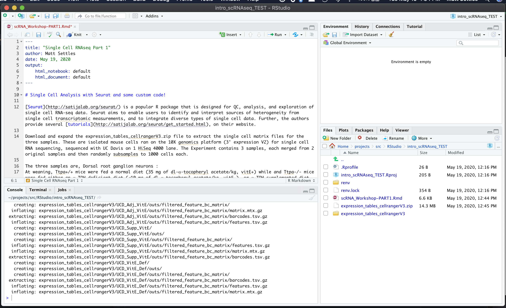

### Create a new RStudio project

Open RStudio and create a new project, for more info see (Using-Projects)[https://support.rstudio.com/hc/en-us/articles/200526207-Using-Projects]

* File > New Project > New Directory > New Project (name the new directory, Ex. Differential_Expression) and check "use renv with this project" if present.

Learn more about (renv)[https://rstudio.github.io/renv/articles/renv.html]

Set some options and make sure the packages Seurat, sva, ggplot2, dplyr, limma, topGO, WGCNA are installed (if not install it), and then load them and verify they all loaded correctly.

In the R console run the following commands
```r

if (!any(rownames(installed.packages()) == "Seurat")){
  if (!requireNamespace("BiocManager", quietly = TRUE))
      install.packages("BiocManager")
  BiocManager::install("Seurat")
}
library(Seurat)

if (!any(rownames(installed.packages()) == "sva")){
  if (!requireNamespace("BiocManager", quietly = TRUE))
      install.packages("BiocManager")
  BiocManager::install("sva")
}
library(sva)

if (!any(rownames(installed.packages()) == "scran")){
  if (!requireNamespace("BiocManager", quietly = TRUE))
      install.packages("BiocManager")
  BiocManager::install("scran")
}
library(scran)

if (!any(rownames(installed.packages()) == "ggplot2")){
  if (!requireNamespace("BiocManager", quietly = TRUE))
      install.packages("BiocManager")
  BiocManager::install("ggplot2")
}
library(ggplot2)

if (!any(rownames(installed.packages()) == "dplyr")){
  if (!requireNamespace("BiocManager", quietly = TRUE))
      install.packages("BiocManager")
  BiocManager::install("dplyr")
}
library(dplyr)

if (!any(rownames(installed.packages()) == "knitr")){
  if (!requireNamespace("BiocManager", quietly = TRUE))
      install.packages("BiocManager")
  BiocManager::install("knitr")
}
library(knitr)

if (!any(rownames(installed.packages()) == "kableExtra")){
  if (!requireNamespace("BiocManager", quietly = TRUE))
      install.packages("BiocManager")
  BiocManager::install("kableExtra")
}
library(kableExtra)

if (!any(rownames(installed.packages()) == "limma")){
  if (!requireNamespace("BiocManager", quietly = TRUE))
      install.packages("BiocManager")
  BiocManager::install("limma")
}
library(limma)

if (!any(rownames(installed.packages()) == "biomaRt")){
  if (!requireNamespace("BiocManager", quietly = TRUE))
      install.packages("BiocManager")
  BiocManager::install("biomaRt")
}
library(biomaRt)

if (!any(rownames(installed.packages()) == "topGO")){
  if (!requireNamespace("BiocManager", quietly = TRUE))
      install.packages("BiocManager")
  BiocManager::install("topGO")
}
library(topGO)

if (!any(rownames(installed.packages()) == "org.Mm.eg.db")){
  if (!requireNamespace("BiocManager", quietly = TRUE))
      install.packages("BiocManager")
  BiocManager::install("org.Mm.eg.db")
}
library(org.Mm.eg.db)

if (!any(rownames(installed.packages()) == "WGCNA")){
  if (!requireNamespace("BiocManager", quietly = TRUE))
      install.packages("BiocManager")
  BiocManager::install("WGCNA")
}
library(WGCNA)

if (!any(rownames(installed.packages()) == "rmarkdown")){
  if (!requireNamespace("BiocManager", quietly = TRUE))
      install.packages("BiocManager")
  BiocManager::install("rmarkdown")
}
library(rmarkdown)

if (!any(rownames(installed.packages()) == "tinytex")){
  if (!requireNamespace("BiocManager", quietly = TRUE))
      install.packages("BiocManager")
  BiocManager::install("tinytex")
}
library(tinytex)

sessionInfo()
```

### Download the template Markdown workshop document PART1 and open it.

In the R console run the following command
```r
download.file("https://raw.githubusercontent.com/ucdavis-bioinformatics-training/2020-Intro_Single_Cell_RNA_Seq/master/data_analysis/scRNA_Workshop-PART1.Rmd", "scRNA_Workshop-PART1.Rmd")
```

### Download the data for the workshop, extract it.

In the R console run the following command.
```r
download.file("https://raw.githubusercontent.com/ucdavis-bioinformatics-training/2020-Intro_Single_Cell_RNA_Seq/master/datasets/expression_tables_cellrangerV3.zip", "expression_tables_cellrangerV3.zip")
system("unzip expression_tables_cellrangerV3.zip") # works in Linux and Mac, not sure about Windows"
```

### Edit the file YAML portion

The top YAML (YAML ain't markup language) portion of the doc tells RStudio how to parse the document.

<pre><code>---
title: "Single Cell RNAseq Part 1"
author: your_name
date: current_date
output:
    html_notebook: default
    html_document: default
---</code></pre>


Your RStudio should look something like this


